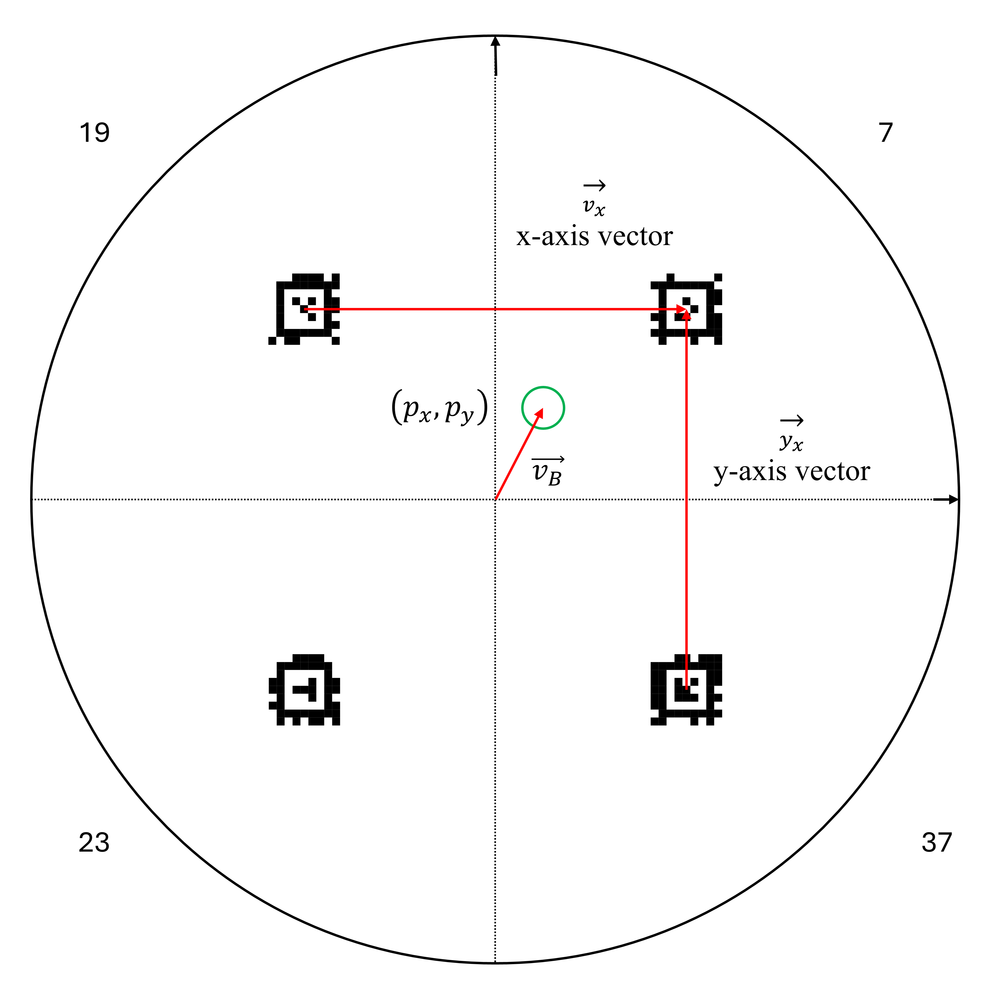
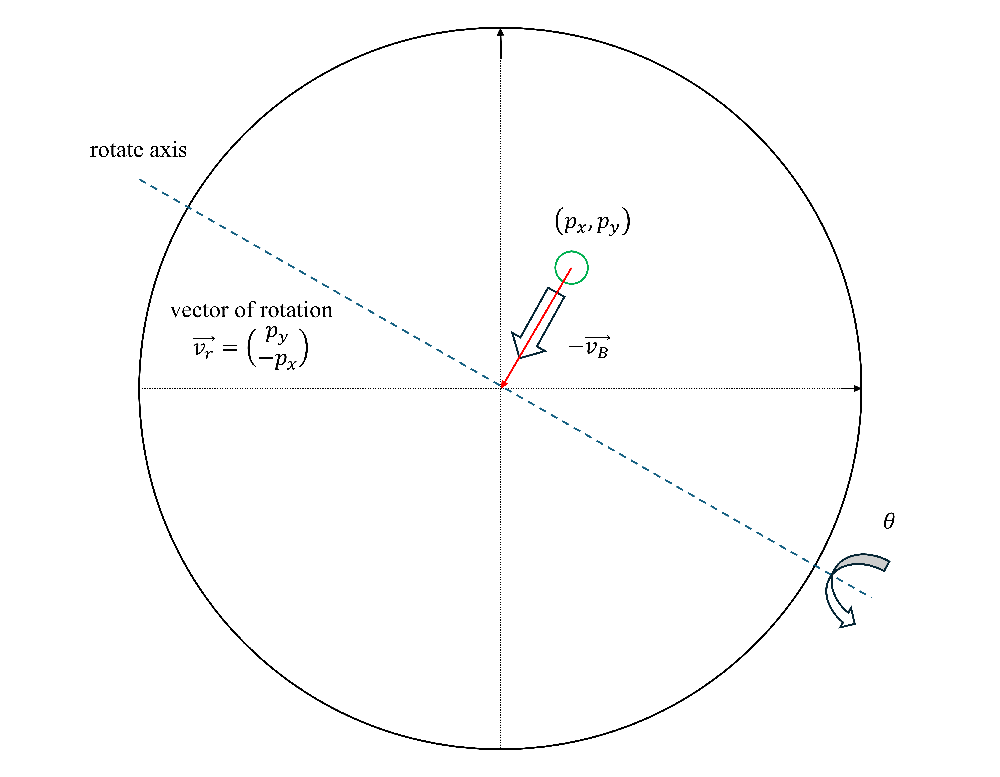

# Ball Balancing Robot
This is a ball balancing robot project that stabilizes a ball on a surface using servo motor control and camera recognition with a single PID controller.

## Description
The project is implemented on a Raspberry Pi 5 and a rpi camera, and the robot is composed of three servo motors arms and a flat platform.

### Localization
Four AprilTags are attached to the localized the position of the ball with this formula:
```math
p_x =\vec{v_x} \cdot \vec{v_B} \\
p_y =\vec{v_y} \cdot \vec{v_B}
```


### Closed-Loop Control
PID controllers applied to two axes is a common way to control ball position like this. However, I feel we need something new here. Therefore, instead of two PID controllers, can we stabilize the ball with only one PID controller?

The answer is certain.

Assume the origin is the stable point (can be any point on the platform). We can guide the ball directly to the stable point with a vector by tilting the entire platform along an axis determined by the vector pointing to the stable point.


Then the tilting angle can be determined with a single PID controller.

[](https://www.youtube.com/watch?v=XOHmK8uWDkU)


